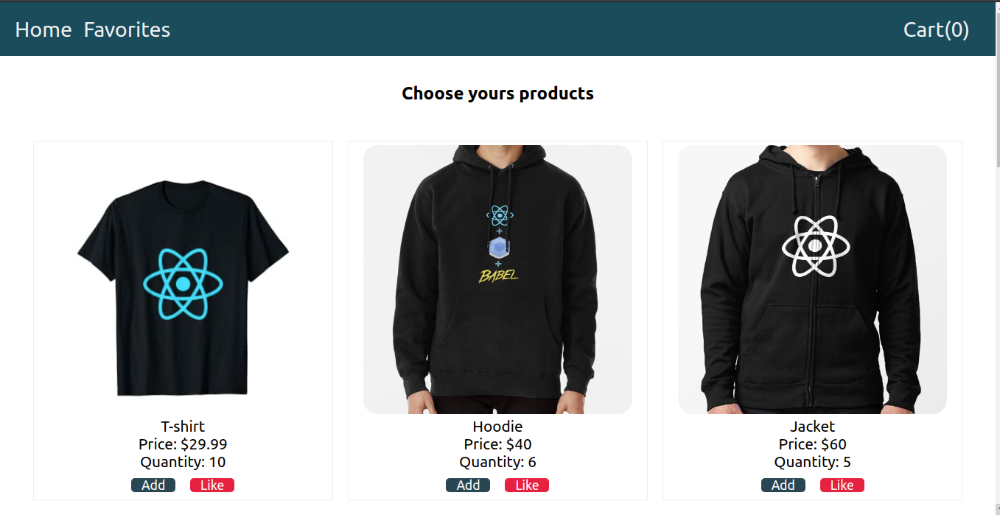
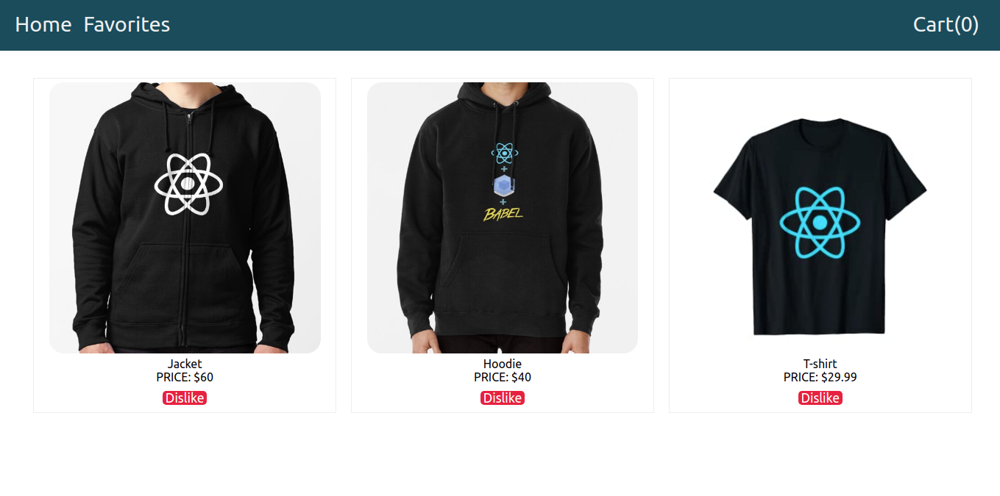
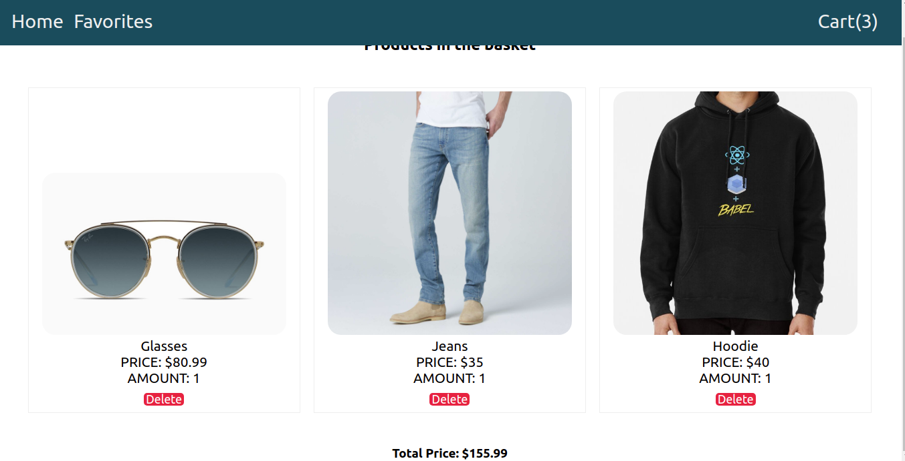

# Shop online example!

This is a project develop with **React Js**, where try to show how to use **Redux** like state managment.

In this project only use a couple libraries.

> react-redux
> redux

## Use and send your Pull Request

for using this project you can clone or download, then.

> Install the dependencies

- npm install
  > Run the project
- npm start

If you have a new feature, consider yourself free to send a PR.

